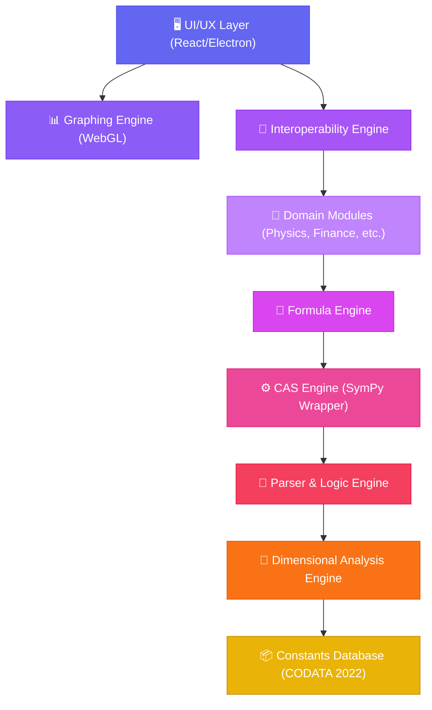

# 🏛️ SuperCalcee Architecture

SuperCalcee is built on a **dual-stack architecture** designed for high-performance scientific computation and a premium user experience.

---

## 🏗️ The 7-Layer Engine

The core logic is structured into seven distinct layers that stack on top of each other, ensuring modularity and dimensional correctness at every level.

### 1. Dimensional & Constants Layer (The Foundation)
At the bottom sits the **CODATA 2022** constants database and the **Dimensional Analysis Engine**. Every calculation in SuperCalcee is unit-aware. If you try to add `5 Joules` to `10 Watts`, the engine will throw a dimensional error before the math even begins.

### 2. Parser & CAS Engine (The Brain)
The **Parser** converts human-readable strings into Abstract Syntax Trees (AST). These are then processed by our **CAS (Computer Algebra System) Engine**, which leverages Python's `SymPy` for symbolic differentiation, integration, and algebraic simplification.

### 3. Formula & Domain Modules (The Knowledge)
Every formula in SuperCalcee is an "intelligent object." The **Formula Engine** can solve for any missing variable given the others. On top of this, we've built specialized **Domain Modules**:
- **Physics**: Newton, Maxwell, Quantum.
- **Astrophysics**: Orbital mechanics, Black hole physics.
- **Finance**: Options pricing, NPV, IRR.
- **Biology**: Population genetics, Michaelis-Menten kinetics.

---

## 💻 Technical Stack

### Backend (Computation)
- **Python 3.10+**: Chosen for its robust scientific ecosystem.
- **FastAPI**: Provides a high-speed, type-safe REST API for the frontend.
- **SymPy**: Powers the symbolic math engine.
- **NumPy**: Handles high-performance numeric arrays.

### Frontend (User Interface)
- **Electron**: Enables a native desktop experience with web technologies.
- **React 19**: Manages a complex, dynamic state for multi-domain workflows.
- **Vite**: Ultra-fast build tool and dev server.
- **Lucide React**: Premium iconography.

---

## 🔗 Cross-Domain Interoperability

One of SuperCalcee's unique features is its ability to link concepts across domains. For example, the mathematical concept of **Entropy** is linked between:
1.  **Thermodynamics** (Physics Module)
2.  **Information Theory** (CS Module)

This allows users to explore how universal mathematical structures manifest in different scientific fields.

---

## 🛡️ Safety & Precision
- **Strict PEMDAS**: No ambiguous evaluation.
- **Exact Symbolic Result**: Prefers exact fractions and radicals (e.g., `sqrt(2)`) over decimal approximations unless requested.
- **Middleware Validation**: Dimensional checks are enforced as middleware, ensuring no domain module can bypass physical laws.
