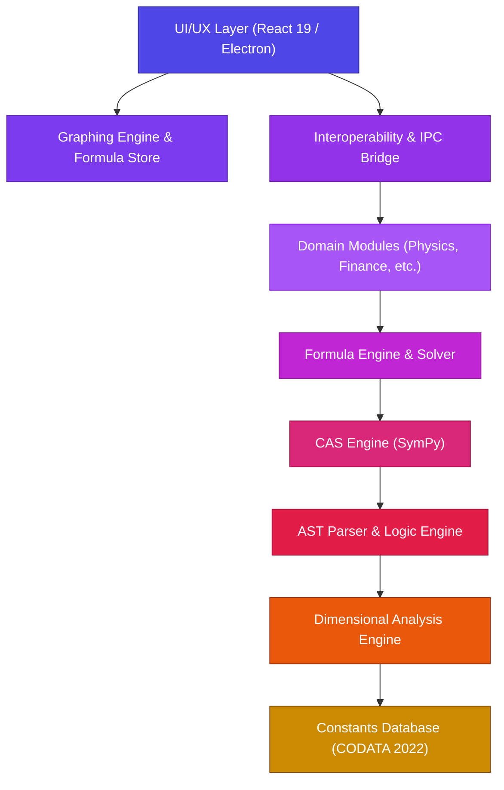

# SuperCalcee Technical Architecture

SuperCalcee is engineered on a decoupled, dual-stack architecture designed for high-performance scientific computation, symbolic algebra, and a modern desktop user experience.

---

## The 7-Layer Core Engine

The computational engine is structured into seven distinct, decoupled layers. Each layer enforces strict physical and mathematical invariants, ensuring dimensional consistency and numerical accuracy at every step.

### Layer Details

#### 1. Constants & Dimensional Analysis Layer
At the base level, SuperCalcee embeds the complete **CODATA 2022** physical constants database alongside a custom **Dimensional Analysis Engine**. Every variable and numerical result carries unit dimensions. Incompatible operations (such as adding energy in Joules to power in Watts) are flagged prior to execution.

#### 2. AST Parser & CAS Engine
The **AST Parser** transforms mathematical expressions into structured Abstract Syntax Trees. The **CAS (Computer Algebra System) Engine**, backed by Python's `SymPy`, executes symbolic differentiation, integration, series expansion, matrix operations, and algebraic simplification.

#### 3. Formula Engine & Domain Modules
The **Formula Engine** provides algebraic solving capabilities, dynamically isolating any missing variable given a set of known quantities. Specialized domain modules build upon this foundation:
* **Physics**: Mechanics, Electromagnetism, Optics, Thermodynamics.
* **Astrophysics**: Orbital mechanics, Schwarzschild metrics, Stellar luminosity.
* **Chemistry**: Stoichiometry, Ideal Gas laws, Solution molarity.
* **Biology**: Population genetics (Hardy-Weinberg), Michaelis-Menten enzyme kinetics.
* **Computer Science**: Information entropy, Algorithmic time complexity.
* **Finance**: Compound interest, Option pricing (Black-Scholes), Net Present Value (NPV), Internal Rate of Return (IRR).

#### 4. Interoperability & Desktop UI Layer
The frontend is built with **React 19** running inside an **Electron** shell. Communication between the frontend and the Python backend occurs asynchronously via HTTP/REST endpoints hosted by FastAPI.

---

## Technology Stack

### Backend Stack
* **Python 3.10+**: Core scientific computation runtime.
* **FastAPI & Uvicorn**: Asynchronous, high-throughput REST API server.
* **SymPy**: Computer Algebra System powering symbolic operations.
* **NumPy**: High-performance array operations and numerical routines.
* **Pydantic**: Data validation and strict type handling across API endpoints.

### Frontend Stack
* **Electron**: Native desktop application container.
* **React 19**: Modern component-driven user interface.
* **Vite**: High-speed build pipeline and development server.
* **Lucide React**: Vector iconography for clean UI elements.
* **Tailwind CSS / Vanilla CSS**: Modern design system supporting dark glassmorphism.

---

## Cross-Domain Mathematical Interoperability

SuperCalcee provides cross-domain linking for mathematical concepts that manifest across scientific disciplines. For instance, **Entropy** is linked across:
1. **Thermodynamics** (Physics Module): Thermal dissipation and statistical mechanics.
2. **Information Theory** (Computer Science Module): Shannon entropy and channel capacity.

---

## Safety and Precision Constraints

* **Strict Syntax Enforcement**: Unambiguous operator evaluation powered by formal AST parsing.
* **Exact Symbolic Representation**: Results retain exact analytical forms (such as radicals and rational fractions) until explicit numerical evaluation is requested.
* **Dimensional Middleware**: Units are validated automatically before evaluation proceeds to domain modules.
