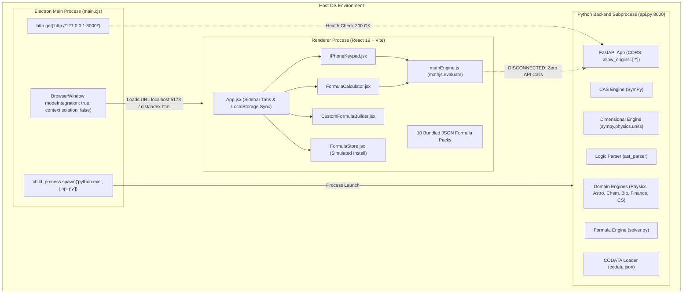
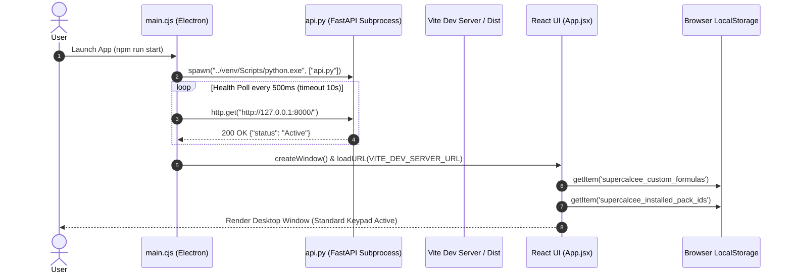
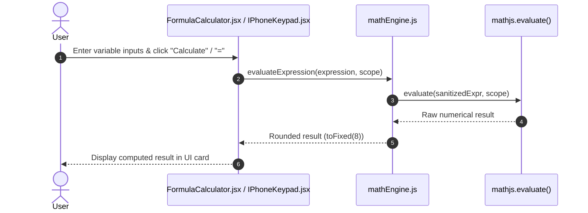
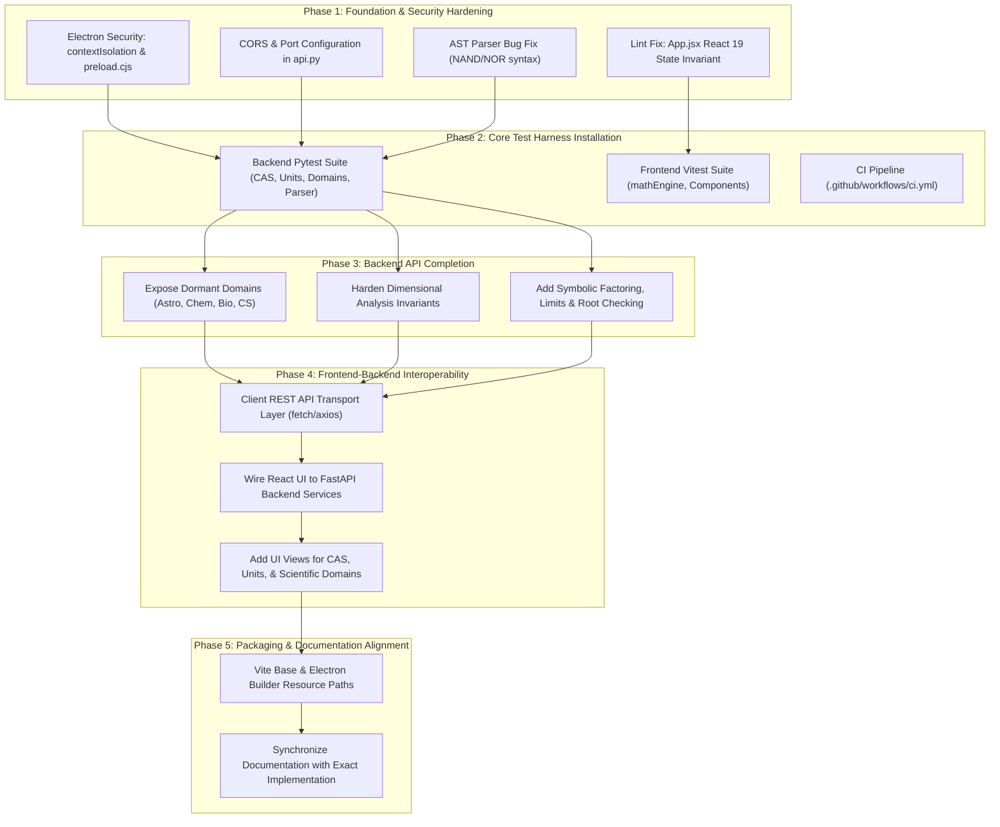

# SuperCalcee Engineering Audit & Repository Reconnaissance Report

**Document Version:** 1.0.0  
**Audit Date:** 2026-09-22  
**Auditor:** Lead Systems Architect / Core Engineering  
**Repository:** `SuperCalcee` (`MasterZ1311/SuperCalcee`)  
**Scope:** Complete repository reconnaissance prior to architectural refactoring and feature implementation.  
**Constraint Enforced:** No functional source code modifications made during this audit.

---

## Table of Contents

1. [Executive Summary](#1-executive-summary)
2. [Section A: Architecture Map](#section-a-architecture-map)
3. [Section B: Execution & Data-Flow Map](#section-b-execution--data-flow-map)
4. [Section C: Main Entry Points](#section-c-main-entry-points)
5. [Section D: Frontend Modules](#section-d-frontend-modules)
6. [Section E: Backend Modules](#section-e-backend-modules)
7. [Section F: Security-Sensitive Code & Vulnerability Audit](#section-f-security-sensitive-code--vulnerability-audit)
8. [Section G: Data-Sensitive Code & State Persistence](#section-g-data-sensitive-code--state-persistence)
9. [Section H: Test Coverage Assessment](#section-h-test-coverage-assessment)
10. [Section I: Build & Deployment Pipeline](#section-i-build--deployment-pipeline)
11. [Section J: Known Technical Debt](#section-j-known-technical-debt)
12. [Section K: Dead, Dormant, & Unused Code](#section-k-dead-dormant--unused-code)
13. [Section L: Documentation Mismatches & Fabrications](#section-l-documentation-mismatches--fabrications)
14. [Section M: Files Likely to Require Changes](#section-m-files-likely-to-require-changes)
15. [Section N: Proposed Dependency Graph for Future Fixes](#section-n-proposed-dependency-graph-for-future-fixes)
16. [Section O: Static Checks Execution Report](#section-o-static-checks-execution-report)

---

## 1. Executive Summary

SuperCalcee is described across its documentation as an advanced, dual-stack desktop scientific calculator and symbolic computation platform combining a **React 19 / Electron** desktop shell with a **FastAPI / SymPy** Python scientific backend.

The comprehensive audit revealed a critical architectural finding:
> **The React frontend and the Python backend are completely disconnected.**  
> While the Electron main process spawns the Python backend and polls it for health on startup, the React application contains **zero** HTTP fetch calls, REST clients, or IPC communications targeting the FastAPI server. All UI calculations execute entirely in the browser thread via client-side `mathjs`, rendering the entire Python backend (SymPy CAS, CODATA dimensional units, AST boolean logic, and domain modules) dormant from the user interface perspective.

Furthermore, severe security weaknesses were identified in the Electron configuration (`nodeIntegration: true`, `contextIsolation: false`), expression parsing routes utilize unbounded SymPy `parse_expr` (which runs `eval()` under the hood), zero automated test files exist across the repository, and the ESLint static check currently fails on `App.jsx`.

---

## Section A: Architecture Map

### 1. High-Level System Architecture



### 2. Physical File Tree & Layer Mapping

```text
SuperCalcee/
├── .gitignore
├── requirements.txt                      # Root Python dependencies (fastapi, sympy, numpy...)
├── README.md                             # Top-level documentation
│
├── docs/                                 # Architectural and operational documentation
│   ├── ARCHITECTURE.md                   # 7-layer architecture claims
│   ├── ELECTRON_FRONTEND.md              # Frontend architecture guide
│   ├── FUTURE_SCOPE.md                   # Development roadmap
│   ├── HOW_TO_RUN.md                     # Setup and execution guide
│   ├── PYTHON_BACKEND.md                 # Backend API documentation
│   ├── SUPERCALCEE.md                    # Multi-domain math specifications
│   ├── UNDERSTANDING_SUPERCALCEE.md      # Core philosophy and invariant rules
│   └── WALKTHROUGH.md                    # Refactoring history
│
├── src_electron/                         # Desktop UI and native shell
│   ├── .gitignore
│   ├── eslint.config.js                  # ESLint 9 flat configuration
│   ├── index.html                        # HTML entry point (title: 'src_electron')
│   ├── main.cjs                          # Electron main lifecycle & process supervisor
│   ├── package.json                      # Node dependencies, scripts & electron-builder config
│   ├── package-lock.json
│   ├── vite.config.js                    # Vite 8 build configuration
│   ├── public/
│   │   └── favicon.svg
│   └── src/
│       ├── App.jsx                       # Root React component, modes & navigation
│       ├── index.css                     # Global styles, variables & glassmorphism
│       ├── main.jsx                      # React 19 DOM bootstrap
│       ├── components/
│       │   ├── ConstantsDropdown.jsx     # CODATA client selector popover
│       │   ├── CustomFormulaBuilder.jsx  # User formula creator with localStorage sync
│       │   ├── FormulaCalculator.jsx     # Multi-variable formula execution card
│       │   ├── FormulaStore.jsx          # Formula pack browser/installer
│       │   └── IPhoneKeypad.jsx          # iOS-style standard scientific keypad
│       ├── data/
│       │   ├── constants.js              # Hardcoded client-side constants database
│       │   ├── packRegistry.js           # Formula pack catalog importer
│       │   ├── presetFormulas.js         # Default formula catalogue across domain modes
│       │   └── formula_packs/            # 10 JSON packs (84 total formulas)
│       │       ├── finance_banking.json
│       │       ├── finance_corporate.json
│       │       ├── finance_investing.json
│       │       ├── math_algebra.json
│       │       ├── math_geometry2d.json
│       │       ├── math_geometry3d.json
│       │       ├── physics_electro.json
│       │       ├── physics_mechanics.json
│       │       ├── physics_optics.json
│       │       └── physics_thermo.json
│       └── utils/
│           └── mathEngine.js             # Client evaluation utility wrapping mathjs
│
└── src_python/                           # Python computation engine
    ├── __init__.py                       # Package export (__version__ = "1.0.0")
    ├── api.py                            # FastAPI application server (Port 8000)
    ├── requirements.txt                  # Backend duplicate requirements.txt
    ├── cas/
    │   ├── __init__.py
    │   └── symbolic_engine.py            # SymPy wrapper (diff, int, solve, simplify)
    ├── constants/
    │   ├── __init__.py
    │   ├── codata.json                   # CODATA 2022 physical constants JSON (64 lines)
    │   └── loader.py                     # ConstantsDatabase reader & query interface
    ├── domains/                          # Domain-specific science engines
    │   ├── __init__.py
    │   ├── astrophysics.py               # Schwarzschild, Kepler, Drake equations
    │   ├── biology.py                    # Michaelis-Menten, Hardy-Weinberg
    │   ├── chemistry.py                  # Nernst, Gibbs Free Energy, Reaction kinetics
    │   ├── cs.py                         # Shannon entropy, Big-O asymptotic limits
    │   ├── finance.py                    # NPV, IRR, WACC, Black-Scholes options
    │   └── physics.py                    # E=mc^2, Heisenberg uncertainty, F=ma
    ├── formula_engine/
    │   ├── __init__.py
    │   └── solver.py                     # Algebraic equation solver & root finder
    ├── parser/
    │   ├── __init__.py
    │   └── ast_parser.py                 # Boolean logic parser & simplifier
    └── units/
        ├── __init__.py
        └── dimensional.py                # Unit conversion engine via sympy.physics.units
```

---

## Section B: Execution & Data-Flow Map

### 1. Actual Startup Flow



### 2. Runtime Calculation Data-Flow (Current Reality)



*Note: In the current implementation, zero computation reaches the Python backend at runtime.*

---

## Section C: Main Entry Points

### 1. Desktop Process Entry Point: `src_electron/main.cjs`
* **File:** [`src_electron/main.cjs`](file:///e:/Github/GitProjects/SuperCalcee/src_electron/main.cjs)
* **Lifecycle:**
  1. `app.on('ready')`: Spawns Python virtual environment interpreter at `../venv/Scripts/python.exe` with target `../src_python/api.py`.
  2. `waitForBackend("http://127.0.0.1:8000/", 10000, 500)`: Polls the FastAPI health endpoint.
  3. `createWindow()`: Instantiates a 1280x800 native window with insecure web preferences (`nodeIntegration: true`, `contextIsolation: false`).
  4. `app.on('quit')`: Attempts to terminate `pythonProcess.kill()`.
* **Platform Flaw:** Path resolution for Python is hardcoded to Windows venv structure (`venv/Scripts/python.exe`). Fails on macOS/Linux (`venv/bin/python`).

### 2. Frontend Web/Renderer Entry Point: `src_electron/src/main.jsx`
* **File:** [`src_electron/src/main.jsx`](file:///e:/Github/GitProjects/SuperCalcee/src_electron/src/main.jsx)
* **Mount:** Mounts root component `<App />` to DOM element `#root` wrapped in `React.StrictMode`.
* **CSS:** Imports global stylesheet `src_electron/src/index.css`.

### 3. Backend REST Server Entry Point: `src_python/api.py`
* **File:** [`src_python/api.py`](file:///e:/Github/GitProjects/SuperCalcee/src_python/api.py)
* **Execution:** Direct invocation via `python api.py` starts a Uvicorn ASGI web server on `127.0.0.1:8000`.
* **Routes:** Provides 12 HTTP endpoints spanning CAS, units, formula solving, and 4 specific domain equations.

---

## Section D: Frontend Modules

| Component / Module | File Path | Responsibilities | Dependencies | Data Persistence |
| :--- | :--- | :--- | :--- | :--- |
| **Root Shell** | [`App.jsx`](file:///e:/Github/GitProjects/SuperCalcee/src_electron/src/App.jsx) | Mode switching (Standard, Physics, Finance, Math, Custom, Store), pack installation state. | `lucide-react`, components, data | `localStorage` (`supercalcee_custom_formulas`, `supercalcee_installed_pack_ids`) |
| **Keypad** | [`IPhoneKeypad.jsx`](file:///e:/Github/GitProjects/SuperCalcee/src_electron/src/components/IPhoneKeypad.jsx) | iOS-inspired arithmetic & scientific keypad. Visual glyph sanitization (`×` $\to$ `*`, `÷` $\to$ `/`). | `mathEngine.js` | None (in-memory state) |
| **Formula Calculator** | [`FormulaCalculator.jsx`](file:///e:/Github/GitProjects/SuperCalcee/src_electron/src/components/FormulaCalculator.jsx) | Dynamic variable input generator, constant insertion dropdowns, local formula evaluation. | `mathEngine.js`, `ConstantsDropdown.jsx` | Component state |
| **Formula Store** | [`FormulaStore.jsx`](file:///e:/Github/GitProjects/SuperCalcee/src_electron/src/components/FormulaStore.jsx) | Catalog view of 10 bundled packs. Simulated installation by toggling pack IDs in state. | `packRegistry.js`, `lucide-react` | State callback to `App.jsx` |
| **Formula Builder** | [`CustomFormulaBuilder.jsx`](file:///e:/Github/GitProjects/SuperCalcee/src_electron/src/components/CustomFormulaBuilder.jsx) | Interactive form for users to enter custom expressions and variable lists. | React | Saves to `App.jsx` $\to$ `localStorage` |
| **Constants Selector** | [`ConstantsDropdown.jsx`](file:///e:/Github/GitProjects/SuperCalcee/src_electron/src/components/ConstantsDropdown.jsx) | Popover menu categorizing Math, Physics, and Finance constants. | `constants.js` | Emits `onSelect(value, symbol)` |
| **Client Math Utility** | [`mathEngine.js`](file:///e:/Github/GitProjects/SuperCalcee/src_electron/src/utils/mathEngine.js) | Evaluates mathematical strings with variable scope; rounds output to 8 decimal places. | `mathjs` (`evaluate`) | Stateless |
| **Pack Registry** | [`packRegistry.js`](file:///e:/Github/GitProjects/SuperCalcee/src_electron/src/data/packRegistry.js) | Bundles and categorizes 10 JSON formula files into `FORMULA_PACKS`. | 10 JSON pack files | Read-only static registry |
| **Preset Formulas** | [`presetFormulas.js`](file:///e:/Github/GitProjects/SuperCalcee/src_electron/src/data/presetFormulas.js) | Out-of-the-box catalog of 32 equations across Physics, Accounts, and Math. | None | Read-only static dataset |
| **Client Constants** | [`constants.js`](file:///e:/Github/GitProjects/SuperCalcee/src_electron/src/data/constants.js) | 20 hardcoded physical and financial constants for frontend insertion. | None | Read-only static dataset |

---

## Section E: Backend Modules

| Module | File Path | Core Engine Class / Instance | Public Methods Available | Exposed in `api.py`? |
| :--- | :--- | :--- | :--- | :--- |
| **CAS Engine** | [`symbolic_engine.py`](file:///e:/Github/GitProjects/SuperCalcee/src_python/cas/symbolic_engine.py) | `CASEngine` (`cas_engine`) | `parse`, `simplify`, `factor`, `expand`, `differentiate`, `integrate`, `limit`, `solve` | Partially: `simplify`, `differentiate`, `integrate`, `solve` (`factor`, `expand`, `limit` missing) |
| **Constants DB** | [`loader.py`](file:///e:/Github/GitProjects/SuperCalcee/src_python/constants/loader.py) | `ConstantsDatabase` (`DB`) | `load`, `get_value`, `get_unit`, `get_all` | Yes: `GET /constants` |
| **Dimensional Engine**| [`dimensional.py`](file:///e:/Github/GitProjects/SuperCalcee/src_python/units/dimensional.py) | `DimensionalEngine` (`dim_engine`)| `evaluate_with_units`, `convert_units` | Yes: `POST /units/convert` |
| **Formula Engine** | [`solver.py`](file:///e:/Github/GitProjects/SuperCalcee/src_python/formula_engine/solver.py) | `FormulaEngine` (`formula_engine`) | `algebraic_solve`, `numeric_solve` | Partially: `POST /formula/solve` (`numeric_solve` missing) |
| **AST Logic Parser** | [`ast_parser.py`](file:///e:/Github/GitProjects/SuperCalcee/src_python/parser/ast_parser.py) | `LogicParser` (`logic_parser`) | `_preprocess`, `parse`, `simplify`, `evaluate` | Partially: `POST /logic/simplify` (`evaluate` missing) |
| **Physics Domain** | [`physics.py`](file:///e:/Github/GitProjects/SuperCalcee/src_python/domains/physics.py) | `PhysicsEngine` (`physics_engine`)| `energy_mass_equivalence`, `heisenberg_uncertainty`, `newtons_second_law` | Partially: Only `energy_mass_equivalence` (`/physics/emc2`) |
| **Astrophysics Domain**| [`astrophysics.py`](file:///e:/Github/GitProjects/SuperCalcee/src_python/domains/astrophysics.py)| `AstrophysicsEngine` (`astro_engine`)| `schwarzschild_radius`, `keplers_third_law`, `drake_equation` | **No** (0 of 3 methods exposed) |
| **Chemistry Domain** | [`chemistry.py`](file:///e:/Github/GitProjects/SuperCalcee/src_python/domains/chemistry.py) | `ChemistryEngine` (`chem_engine`) | `nernst_equation`, `gibbs_free_energy`, `first_order_kinetics` | **No** (0 of 3 methods exposed) |
| **CS Domain** | [`cs.py`](file:///e:/Github/GitProjects/SuperCalcee/src_python/domains/cs.py) | `ComputerScienceEngine` (`cs_engine`)| `shannon_entropy`, `big_o_limit` | Partially: Only `big_o_limit` (`/cs/big-o`) |
| **Finance Domain** | [`finance.py`](file:///e:/Github/GitProjects/SuperCalcee/src_python/domains/finance.py) | `FinanceEngine` (`finance_engine`)| `npv`, `irr`, `wacc`, `black_scholes` | Partially: Only `black_scholes` (`/finance/black-scholes`) |
| **Biology Domain** | [`biology.py`](file:///e:/Github/GitProjects/SuperCalcee/src_python/domains/biology.py) | `BiologyEngine` (`bio_engine`) | `michaelis_menten`, `hardy_weinberg` | Partially: Only `hardy_weinberg` (`/bio/hardy-weinberg`) |

---

## Section F: Security-Sensitive Code & Vulnerability Audit

The repository was audited against the complete checklist of security patterns. Findings are detailed below:

### 1. Code Injection & Expression Evaluation Audit

| Pattern / Term | Occurrences | Locations | Security Assessment & Risk Analysis |
| :--- | :--- | :--- | :--- |
| **`eval(`** | 0 direct calls | N/A | No direct Python `eval(` calls in SuperCalcee source. However, SymPy's internal `parse_expr` directly calls Python `eval(code, global_dict, local_dict)` on parsed AST. |
| **`exec(`** | 0 calls | N/A | No direct `exec(` calls found. |
| **`parse_expr(`** | 7 calls | `cas/symbolic_engine.py:60`<br>`units/dimensional.py:55`<br>`parser/ast_parser.py:79`<br>`formula_engine/solver.py:58,61`<br>`domains/cs.py:71,72` | **HIGH RISK.** SymPy's `parse_expr` uses Python's `eval()` under the hood. While standard mathematical expressions are safe, passing unsanitized user strings without an AST node whitelist or security transformation allows arbitrary code evaluation or denial-of-service via malformed AST tokens. |
| **`sympify(`** | 0 calls | N/A | None. |
| **`evalf(`** | 1 call | `domains/physics.py:31` | Safe: Used internally to evaluate `sp.pi.evalf()` during constant initialization. |
| **`mathjs.evaluate`** | 1 call | `utils/mathEngine.js:37` | **MEDIUM RISK.** While Math.js v15 prevents prototype pollution, user-supplied custom formulas evaluated via `evaluate(expression, scope)` can execute built-in functions or cause thread lockup with deep recursion or massive arrays. |
| **`innerHTML` / `dangerouslySetInnerHTML`** | 0 occurrences | N/A | Clean. No direct DOM injection via `innerHTML` or React `dangerouslySetInnerHTML`. |

### 2. Native Electron & IPC Boundary Audit

| Property / Pattern | Configuration / Match | Location | Vulnerability Analysis |
| :--- | :--- | :--- | :--- |
| **`nodeIntegration`** | **`true`** | [`src_electron/main.cjs:38`](file:///e:/Github/GitProjects/SuperCalcee/src_electron/main.cjs#L38) | **CRITICAL VULNERABILITY.** Enabling `nodeIntegration` in the renderer grants the React web view full access to Node.js native APIs (`fs`, `child_process`, etc.). Any Cross-Site Scripting (XSS) or injected script instantly becomes full Remote Code Execution (RCE) on the host machine. |
| **`contextIsolation`**| **`false`** | [`src_electron/main.cjs:39`](file:///e:/Github/GitProjects/SuperCalcee/src_electron/main.cjs#L39) | **CRITICAL VULNERABILITY.** Disabling `contextIsolation` allows website scripts to directly manipulate Electron internals and Node context. Violates official Electron Security Best Practices Rule #3. |
| **`sandbox`** | Not enabled (default disabled with `nodeIntegration: true`) | [`src_electron/main.cjs:37-40`](file:///e:/Github/GitProjects/SuperCalcee/src_electron/main.cjs#L37-L40) | **HIGH RISK.** Renderer is not sandboxed. |
| **`preload` script** | None | [`src_electron/main.cjs`](file:///e:/Github/GitProjects/SuperCalcee/src_electron/main.cjs) | No preload bridge exists. The app exposes full Node context instead of a safe `contextBridge.exposeInMainWorld` interface. |
| **`ipcMain` / `ipcRenderer`** | 0 calls | Entire repository | Electron IPC is completely absent. |

### 3. Network & Process Boundary Audit

| Pattern / Boundary | Match / Setting | Location | Assessment |
| :--- | :--- | :--- | :--- |
| **CORS `allow_origins`**| `allow_origins=["*"]`<br>`allow_credentials=True` | [`src_python/api.py:57-58`](file:///e:/Github/GitProjects/SuperCalcee/src_python/api.py#L57-L58) | **HIGH RISK.** Wildcard `allow_origins=["*"]` combined with `allow_credentials=True` is an invalid and dangerous combination in CORS specifications. Any website visited by the user in a standard browser can make unauthorized cross-origin requests to `http://127.0.0.1:8000`. |
| **`child_process.spawn`**| `spawn(pythonExecutable, [apiScript], ...)` | [`src_electron/main.cjs:64`](file:///e:/Github/GitProjects/SuperCalcee/src_electron/main.cjs#L64) | Fixed argument list. No shell command concatenation or injection vector. However, hardcoded Windows path causes process failure on other platforms. |
| **`shell=True` / `os.system`**| 0 occurrences | Entire repository | None present. |
| **Hardcoded Port 8000** | `8000` | [`src_electron/main.cjs:118`](file:///e:/Github/GitProjects/SuperCalcee/src_electron/main.cjs#L118)<br>[`src_python/api.py:253`](file:///e:/Github/GitProjects/SuperCalcee/src_python/api.py#L253) | Port collision vulnerability. If port 8000 is occupied by another service, the application either connects to a foreign service or crashes on startup. |

---

## Section G: Data-Sensitive Code & State Persistence

### 1. Storage Mechanisms
* **Browser `localStorage`**:
  * **Keys:**
    * `supercalcee_custom_formulas`: Stores an array of custom formula objects (`{ id, name, desc, expression, variables, unit, isCustom }`).
    * `supercalcee_installed_pack_ids`: Stores an array of string IDs (e.g. `["pack_physics_mech"]`).
  * **Sensitivity:** No authentication tokens, credentials, or PII are stored. However, formula expressions saved by users are re-loaded and evaluated with `mathEngine.js`. Malformed expressions persisted in `localStorage` can crash the UI on subsequent reloads.

### 2. File System Access
* **Python File Access:**
  * Only one instance of file I/O exists in the entire backend:
    [`src_python/constants/loader.py:44`](file:///e:/Github/GitProjects/SuperCalcee/src_python/constants/loader.py#L44):
    ```python
    filepath = os.path.join(os.path.dirname(__file__), "codata.json")
    with open(filepath, "r", encoding="utf-8") as f:
        self.constants = json.load(f)
    ```
  * Safely scoped to internal package directory. No path traversal risks.
* **Frontend File Access:** None.

---

## Section H: Test Coverage Currently Available

### Current Test Inventory: **0 Tests (0.0% Coverage)**
1. **Automated Test Directory:** None found. No `tests/`, `test/`, `__tests__/`, or `spec/` directories exist in either `src_electron` or `src_python`.
2. **Backend Tests:**
   * `requirements.txt` specifies `pytest>=7.0.0`.
   * Executing `python -m pytest` yields:
     `collected 0 items / no tests ran in 0.11s (exit code 1)`.
   * Zero unit tests or integration tests exist for any Python module.
3. **Frontend Tests:**
   * `package.json` contains no test runner (`vitest` or `jest` are not installed).
   * Zero test scripts exist in `package.json`.
4. **Documentation Inconsistency:**
   * [`docs/WALKTHROUGH.md:35`](file:///e:/Github/GitProjects/SuperCalcee/docs/WALKTHROUGH.md#L35) claims:
     > *"Verified Python FastAPI backend endpoints (`/cas/simplify`, `/cas/differentiate`, `/cas/solve`, `/constants`, `/units/convert`) with automated tests."*
   * **Finding:** This claim is fabricated. No automated tests exist in the codebase.

---

## Section I: Build & Deployment Pipeline

### 1. NPM Scripts & Tooling (`src_electron/package.json`)

```json
"scripts": {
  "dev": "vite",
  "build": "vite build",
  "lint": "eslint .",
  "preview": "vite preview",
  "electron:start": "cross-env VITE_DEV_SERVER_URL=http://localhost:5173 electron .",
  "start": "concurrently \"npm run dev\" \"wait-on http://localhost:5173 && npm run electron:start\"",
  "package": "vite build && electron-builder --dir"
}
```

* **Vite Configuration (`vite.config.js`):**
  * Uses `@vitejs/plugin-react`.
  * **Defect:** Missing `base: './'`. In Vite, the default base is `/`. In an Electron production package loaded via `file://`, asset scripts (`/assets/index.js`) fail to resolve without relative pathing (`./`).
* **Electron Builder Configuration (`package.json`):**
  * `appId`: `com.supercalcee.app`
  * `productName`: `SuperCalcee`
  * `extraResources`: Copies `../venv` and `../src_python`.
  * **Defect:** In production, `extraResources` are placed in `process.resourcesPath`, but `main.cjs` resolves paths using `path.join(__dirname, '..', 'venv', ...)` which points outside the production package bundle. Packaged binaries will fail to locate Python on startup.
* **Continuous Integration (CI / GitHub Actions):**
  * `.github/workflows/` does not exist.
  * No CI/CD configuration is present in the repository.

---

## Section J: Known Technical Debt

1. **Frontend-to-Backend Complete Disconnect:** The application claims to be a hybrid SymPy/FastAPI desktop platform, but the UI is 100% client-side Math.js.
2. **ESLint Static Analysis Failure:** `src_electron/src/App.jsx:69:9` triggers a lint error under React Hooks 19 rules (`react-hooks/set-state-in-effect`) for synchronously calling `setState` inside `useEffect`.
3. **Broken Logic Glyph Parsing in `ast_parser.py`:**
   * Lines 60–61 attempt to substitute NAND (`↑`) with ` ~& ` and NOR (`↓`) with ` ~| `.
   * In Python/SymPy syntax, `A ~& B` causes an immediate `SyntaxError: invalid syntax` because `~` is a unary operator and `&` is a binary operator.
4. **Silent Failure in Unit Conversion (`dimensional.py`):**
   * Calling `convert_units("10 * meter", "second")` returns `10*meter` instead of raising an error because SymPy's `convert_to` returns unconverted expressions when dimensions are incompatible.
   * Contradicts documentation claims that dimensional exceptions are raised.
5. **Rigid Equation Parsing in `solver.py` and `symbolic_engine.py`:**
   * Both use `lhs, rhs = equation_str.split("=")`. Any equation containing multiple `=` characters (or malformed strings) crashes with `ValueError: too many values to unpack`.
6. **Hardcoded Platform Assumptions:**
   * `main.cjs` assumes Windows paths (`venv\Scripts\python.exe`).
   * Port 8000 is hardcoded with no environment variable fallback (`PORT` or `BACKEND_PORT`).
7. **HTML Page Title Oversight:**
   * `src_electron/index.html` title tag is `<title>src_electron</title>`.

---

## Section K: Dead, Dormant, & Unused Code

### 1. Completely Dormant Backend Modules (Unreachable via API)
* [`src_python/domains/astrophysics.py`](file:///e:/Github/GitProjects/SuperCalcee/src_python/domains/astrophysics.py): `astro_engine` is imported in `api.py:33` but has **zero** endpoints.
* [`src_python/domains/chemistry.py`](file:///e:/Github/GitProjects/SuperCalcee/src_python/domains/chemistry.py): `chem_engine` is imported in `api.py:34` but has **zero** endpoints.

### 2. Partially Dormant Backend Code (Implemented but Unexposed)
* `src_python/domains/physics.py`: `heisenberg_uncertainty()` and `newtons_second_law()` are never exposed.
* `src_python/domains/cs.py`: `shannon_entropy()` is never exposed.
* `src_python/domains/finance.py`: `npv()`, `irr()`, and `wacc()` are never exposed.
* `src_python/domains/biology.py`: `michaelis_menten()` is never exposed.
* `src_python/formula_engine/solver.py`: `numeric_solve()` is never exposed.
* `src_python/cas/symbolic_engine.py`: `factor()`, `expand()`, and `limit()` are never exposed.

### 3. Dormant Frontend Assets
* `src_electron/public/favicon.svg` is present but never styled for native window dock/taskbar icons in `main.cjs`.

---

## Section L: Documentation Mismatches & Fabrications

| Document | Statement in Documentation | Verified Ground Truth in Codebase |
| :--- | :--- | :--- |
| **`README.md:20-40`** | Architecture diagram shows React frontend communicating with FastAPI over HTTP REST transport. | **False.** Zero HTTP calls exist in the frontend (`src_electron/src/`). The UI uses `mathjs` exclusively. |
| **`README.md:66-70`** | Instructs user to create venv inside `src_python/venv`. | **Broken.** `main.cjs` specifically expects `../venv` at repository root, causing Electron startup crash if following README. |
| **`ARCHITECTURE.md:13`** | Architecture diagram includes "Graphing Engine" and "IPC Bridge". | **Fabrication.** There is no graphing engine (no Canvas/SVG/Chart.js/Plotly) and zero IPC implementation. |
| **`ARCHITECTURE.md:69`** | Claims frontend uses "Tailwind CSS / Vanilla CSS". | **Mismatch.** Tailwind CSS is neither installed in `package.json` nor configured. Only Vanilla CSS is used. |
| **`ARCHITECTURE.md:75-78`**| Claims cross-domain linking for Entropy across Physics and CS. | **Fabrication.** No code links entropy between modules. |
| **`ELECTRON_FRONTEND.md:38`**| Claims mode switcher supports "Standard, Scientific, CAS, Physics, Astrophysics, Chemistry, Biology, CS, and Finance modes". | **Mismatch.** UI only provides Standard, Physics, Finance, Math, Custom, and Formula Store tabs. CAS, Astro, Chem, Bio, and CS modes do not exist. |
| **`ELECTRON_FRONTEND.md:51`**| Claims `npm run dev` starts both Vite and the Electron shell. | **Mismatch.** `npm run dev` only launches Vite. `npm run start` is required for Electron. |
| **`PYTHON_BACKEND.md:13`** | Tree specifies `src_python/README.md`. | **Missing.** File does not exist. |
| **`PYTHON_BACKEND.md:41`** | Claims `POST /cas/integrate` computes definite and indefinite integrals. | **Mismatch.** Only indefinite integration is supported; no limit parameters are accepted. |
| **`SUPERCALCEE.md:32-43`** | Lists chemistry pH/molarity/stoichiometry, astrophysics Hubble's Law, CS bitwise ops, and finance amortization schedules. | **Fabrications.** None of these algorithms exist in the respective Python modules. |
| **`UNDERSTANDING_SUPERCALCEE.md:23`** | Claims illegal dimensional operations raise dimensional exceptions with diagnostics. | **Mismatch.** `convert_units` silently returns unconverted strings when units are incompatible. |
| **`WALKTHROUGH.md:35`** | Claims endpoints were verified with automated tests. | **Fabrication.** Zero automated tests exist in the repository. |

---

## Section M: Files Likely to Require Changes

The following prioritized list highlights all files that must be modified during upcoming refactoring tasks:

| Priority | File Path | Required Changes |
| :---: | :--- | :--- |
| **P0** | [`src_electron/main.cjs`](file:///e:/Github/GitProjects/SuperCalcee/src_electron/main.cjs) | Fix critical Electron security (`contextIsolation: true`, `nodeIntegration: false`), implement safe `preload.cjs`, fix cross-platform Python paths and production `process.resourcesPath` detection, make port configurable. |
| **P0** | [`src_electron/src/App.jsx`](file:///e:/Github/GitProjects/SuperCalcee/src_electron/src/App.jsx) | Fix ESLint failure (`set-state-in-effect`) by initializing state directly or using proper effects; add missing domain modes (Astrophysics, Chemistry, Biology, CS, CAS). |
| **P0** | [`src_python/parser/ast_parser.py`](file:///e:/Github/GitProjects/SuperCalcee/src_python/parser/ast_parser.py) | Fix broken NAND (`↑`) and NOR (`↓`) syntax expansion (`~&` $\to$ proper boolean AST translation). |
| **P1** | [`src_electron/src/utils/mathEngine.js`](file:///e:/Github/GitProjects/SuperCalcee/src_electron/src/utils/mathEngine.js) | Integrate HTTP/REST client bridge to call Python FastAPI backend for symbolic CAS and domain operations. |
| **P1** | [`src_python/api.py`](file:///e:/Github/GitProjects/SuperCalcee/src_python/api.py) | Fix CORS configuration (disallow wildcard origin with credentials); expose missing endpoints for astrophysics, chemistry, CS entropy, biology Michaelis-Menten, and CAS factoring/limits. |
| **P1** | [`src_python/units/dimensional.py`](file:///e:/Github/GitProjects/SuperCalcee/src_python/units/dimensional.py) | Validate dimensional consistency before conversion and raise explicit `DimensionalError` on incompatible dimensions. |
| **P1** | [`src_python/formula_engine/solver.py`](file:///e:/Github/GitProjects/SuperCalcee/src_python/formula_engine/solver.py) | Harden equation string splitting and parsing; add timeout guards against combinatorial explosion in SymPy solvers. |
| **P2** | [`src_electron/vite.config.js`](file:///e:/Github/GitProjects/SuperCalcee/src_electron/vite.config.js) | Set `base: './'` for reliable asset resolution in packaged Electron distributions. |
| **P2** | [`src_electron/index.html`](file:///e:/Github/GitProjects/SuperCalcee/src_electron/index.html) | Rename title tag to `SuperCalcee — Multi-Domain Scientific Calculator`. |
| **P2** | [`src_electron/package.json`](file:///e:/Github/GitProjects/SuperCalcee/src_electron/package.json) | Rename `"name": "src_electron"` to `"supercalcee"`, add test script (`vitest`), fix builder target mappings. |
| **P2** | [`docs/*`](file:///e:/Github/GitProjects/SuperCalcee/docs/) | Correct all documentation mismatches and remove fabricated claims to reflect actual software capabilities. |
| **P3** | `tests/` (New Directory) | Create automated test suites for both backend (`pytest`) and frontend (`vitest`). |

---

## Section N: Proposed Dependency Graph for Future Fixes

To remediate technical debt and align the repository without circular regressions, fixes should proceed in the following 5 phases:



---

## Section O: Static Checks Execution Report

As instructed, all existing repository static checks and test runners were executed directly on the host system without modification.

### Summary Table of Executed Commands

| # | Exact Command Executed | Working Directory | Exit Code | Result | Key Output / Failure Reason |
| :---: | :--- | :--- | :---: | :---: | :--- |
| 1 | `npm run lint` | `src_electron/` | **1** | **FAILED** | `src_electron/src/App.jsx:69:9: error Error: Calling setState synchronously within an effect can trigger cascading renders (react-hooks/set-state-in-effect)` |
| 2 | `npm run build` | `src_electron/` | **0** | **PASSED** | Transformed 2,798 modules in 37.17s. Generated `dist/index.html` (0.47 kB), `dist/assets/index-CcUr7x0A.css` (4.67 kB), `dist/assets/index-C-cOspNt.js` (885.55 kB). |
| 3 | `python -m py_compile (Get-ChildItem -Recurse -Filter "*.py" src_python)` | Root (`/`) | **0** | **PASSED** | All 18 Python source files compiled without syntax errors. |
| 4 | `python -m pytest` | Root (`/`) | **1** | **FAILED** | `collected 0 items / no tests ran in 0.11s` (Exit code 1 due to absence of any test files). |
| 5 | `python -m flake8 src_python` | Root (`/`) | **1** | **FAILED** | `No module named flake8` (Tool not installed in global environment). |
| 6 | `python -m mypy src_python` | Root (`/`) | **1** | **FAILED** | `No module named mypy` (Tool not installed in global environment). |
| 7 | `python -m ruff check src_python` | Root (`/`) | **1** | **FAILED** | `No module named ruff` (Tool not installed in global environment). |
| 8 | `python -c "import json, glob; [json.load(open(f, encoding='utf-8')) for f in glob.glob('src_electron/src/data/formula_packs/*.json')]"` | Root (`/`) | **0** | **PASSED** | Validated all 10 formula pack JSON files (84 total formula objects). |
| 9 | `python -c "import json; json.load(open('src_python/constants/codata.json', encoding='utf-8'))"` | Root (`/`) | **0** | **PASSED** | Validated `codata.json` constants database. |

---

*Report compiled by Lead Systems Architect following complete static and architectural analysis of the SuperCalcee repository.*
