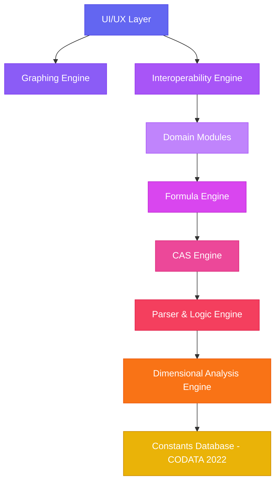
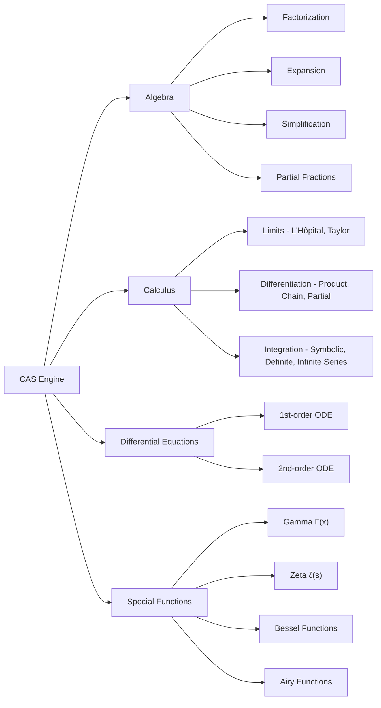
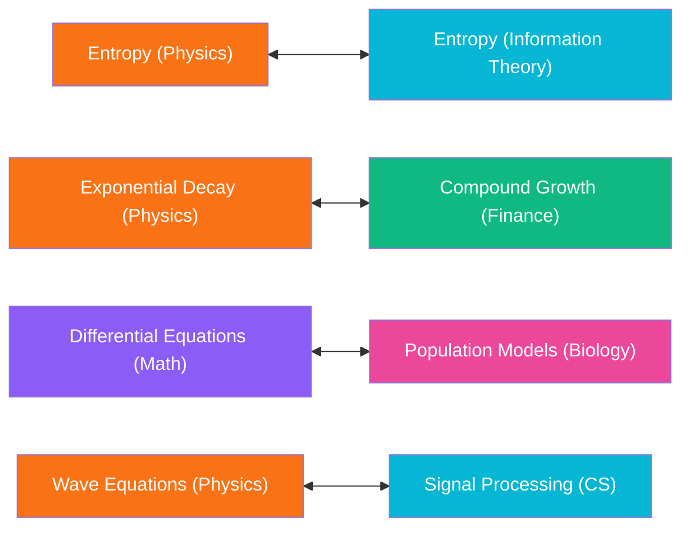

# TECHNICAL ARCHITECTURE & ENGINEERING MANUAL

> **Document Type:** Architectural Deep-Dive & Engineering Design Manual  
> **Unique Purpose:** Provides an exhaustive technical breakdown of SuperCalcee's 7-layer architecture, risk analysis, cross-domain matrix, CAS engine integration, and formula inversion mechanics.  
> **Navigation:** [Root README](file:///e:/Github/GitProjects/SuperCalcee/README.md) | [PRD & Blueprint](file:///e:/Github/GitProjects/SuperCalcee/SUPERCALCEE.md) | [Verification Log](file:///e:/Github/GitProjects/SuperCalcee/walkthrough.md) | [Frontend Guide](file:///e:/Github/GitProjects/SuperCalcee/src_electron/README.md) | [Backend Guide](file:///e:/Github/GitProjects/SuperCalcee/src_python/README.md)

---

## 1. What Is SuperCalcee?

SuperCalcee is **not a calculator** — it's a **unified computational universe interface**. It aims to be a single system that can handle symbolic math, numeric computation, physics simulations, financial modeling, biological systems, computer science analysis, and more — all connected through a shared engine with enforced dimensional correctness.

Think of it as:

| Traditional Tool | SuperCalcee Equivalent |
|---|---|
| Wolfram Alpha | CAS Engine + Formula Engine |
| MATLAB / SciPy | Numeric + Symbolic Computation |
| Desmos | Graphing Engine |
| Physics Textbook | Physics & Astrophysics Domain Modules |
| Financial Calculator | Finance Domain Module (NPV, IRR, Black-Scholes) |
| Logic Prover | Parser & Logic Engine |

**In short:** One interface to replace *all* of these.

---

## 2. High-Level Architecture

The system is organized into **7 core layers** that stack on top of each other:



---

## 3. Module-by-Module Breakdown

### 3.1 Parser & Logic Engine (Layer 1)

**Purpose:** The foundation — converts raw user input into a structured Abstract Syntax Tree (AST).

**Key Capabilities:**

| Category | Details |
|---|---|
| **Arithmetic** | `+ - × ÷` with strict PEMDAS/BODMAS |
| **Logic Gates** | AND `∧`, OR `∨`, XOR `⊕`, NAND `↑`, NOR `↓`, Implication `→`, Biconditional `↔` |
| **Quantifiers** | Universal `∀`, Existential `∃`, Unique Existential `∃!` |
| **Evaluation** | Expression evaluation, logical proposition validation, conditional reasoning, discrete math |

> [!IMPORTANT]
> The parser must handle **multi-domain symbol resolution** — the same symbol might mean different things in physics vs. finance vs. CS. This is a significant design challenge.

---

### 3.2 CAS Engine (Layer 2 — Core)

**Purpose:** The brain — performs symbolic computation, the heart of the entire system.

**Four major sub-systems:**



> [!TIP]
> The CAS is the **highest-risk, highest-reward** component. Building a production-grade CAS from scratch is a multi-year endeavor. Consider leveraging existing CAS libraries (SymPy, Maxima, or GiNaC) as a foundation and wrapping them.

---

### 3.3 Constants Database (CODATA 2022)

**Purpose:** A globally accessible, authoritative database of physical constants.

**Requirements:**
- Based on **CODATA 2022** standard values
- Each constant has: `value`, `unit`, `exact` flag, and `uncertainty`
- Symbol-based invocation (e.g., type `c` → speed of light)

**Four constant categories:**

| Category | Examples |
|---|---|
| Universal | Speed of light `c`, Gravitational constant `G`, Planck's constant `h` |
| Electromagnetic | Elementary charge `e`, Permittivity `ε₀`, Permeability `μ₀` |
| Particle Physics | Electron mass `mₑ`, Proton mass `mₚ`, Fine-structure constant `α` |
| Thermodynamic | Boltzmann constant `k`, Avogadro's number `Nₐ`, Gas constant `R` |

---

### 3.4 Dimensional Analysis Engine

**Purpose:** The safety net — prevents physically meaningless operations.

**Features:**

| Feature | Description |
|---|---|
| **SI Base Mapping** | Maps everything to `m, kg, s, A, K, mol, cd` |
| **Derived Unit Resolution** | `N → kg·m/s²`, `Pa → kg/m·s²`, `J → kg·m²/s²` |
| **Unit Conversion** | SI ↔ Imperial bidirectional conversion |
| **Prefix Scaling** | Full range: `10⁻²⁴` (yocto) → `10²⁴` (yotta) |
| **Validation** | Invalid operations throw exceptions (e.g., `Joules + Watts → ERROR`) |

> [!WARNING]
> This engine must be deeply integrated into **every** computation path. If a domain module bypasses the dimensional engine, incorrect results will silently pass through. This cross-cutting concern needs careful architectural design.

---

### 3.5 Domain Modules (The Knowledge Domains)

Six specialized modules, each encapsulating deep domain expertise:

#### Physics Engine
- Newton's Laws, Maxwell's Equations
- Einstein's `E = mc²`
- Quantum: Heisenberg Uncertainty Principle

#### Astrophysics
- Kepler's Laws, Orbital Mechanics
- Schwarzschild Radius (black hole physics)
- Drake Equation (extraterrestrial civilizations)

#### Chemistry & Thermodynamics
- Nernst Equation (electrochemistry)
- Gibbs Free Energy
- Reaction Kinetics

#### Biology
- Michaelis-Menten Kinetics (enzyme behavior)
- Hardy-Weinberg Equilibrium (population genetics)
- Genetic Simulations

#### Finance
- NPV (Net Present Value)
- IRR (Internal Rate of Return — requires root solving)
- WACC (Weighted Average Cost of Capital)
- Black-Scholes (options pricing)

#### Computer Science
- Big-O Analysis
- Shannon Entropy
- Algorithm Modeling

---

### 3.6 Formula Engine

**Purpose:** Makes every formula a **live, executable object** that can solve for any variable.

**Key Concept — Inverse Solving:**

```
Given: NPV = Σ(CFₜ / (1+r)ᵗ) − I

If you provide:  CFₜ, r, I  → Engine solves for NPV
If you provide:  NPV, CFₜ, I → Engine solves for r (the discount rate)
If you provide:  NPV, r, I   → Engine solves for CFₜ (cash flows)
```

This means **every formula with N variables can be solved given N-1 inputs**. The system intelligently determines which variable is missing and solves for it.

---

### 3.7 Graphing Engine

**Visualization capabilities:**

| Type | Description |
|---|---|
| 2D Graphs | Standard function plots |
| 3D Surfaces | Surface plots for multivariable functions |
| Parametric | Curves defined by parameter equations |
| Polar | Polar coordinate graphs |

**Interactive features:** Zoom, rotate, touch interaction, real-time rendering.

---

### 3.8 Interoperability Engine

**Purpose:** The connective tissue — recognizes that **the same math appears across domains**.

**Cross-Domain Connections:**



> [!NOTE]
> This is one of the most **unique and differentiating** features. No mainstream calculator connects domains like this. For example, a user studying thermodynamic entropy could instantly see how the same concept applies in Shannon information theory.

---

### 3.9 AI Instruction Layer

**Purpose:** Governs how AI-assisted reasoning behaves within the system.

**Rules:**

| Rule | Description |
|---|---|
| Dimensional Correctness | Always enforce — never produce dimensionally invalid results |
| Symbolic Preference | Prefer symbolic (exact) answers over numeric (approximate) |
| Constant Usage | Use CODATA database values, not hardcoded numbers |
| Auto Domain Selection | Automatically detect which domain module to invoke |
| Intelligent Solving | Solve for missing variables without explicit user instruction |

**Response Style:** Structured, step-by-step, minimal fluff, high precision.

---

### 3.10 UI/UX System

| Component | Details |
|---|---|
| **Input** | QWERTY soft keyboard + numeric input system |
| **Navigation** | Document-based system with domain-specific menus |
| **Context Adaptation** | UI dynamically changes based on the active domain |

---

## 4. Development Roadmap

The spec outlines a **4-phase development plan:**

| Phase | Focus | Components |
|---|---|---|
| **Phase 1** | Core Engine | Parser, CAS, Logic System |
| **Phase 2** | Data Layer | CODATA Database, Unit System |
| **Phase 3** | Domain Modules | Physics, Finance, Biology, CS |
| **Phase 4** | UI & Graphing | Visual interface, Plot engine |

---

## 5. Technical Risk Assessment

| Risk | Severity | Mitigation |
|---|---|---|
| Building CAS from scratch | 🔴 **Critical** | Wrap existing CAS libraries (SymPy, Maxima) instead |
| Multi-domain symbol conflicts | 🟠 **High** | Namespace-based symbol resolution with context awareness |
| Dimensional engine bypass | 🟠 **High** | Make dimensional checks a middleware, not optional |
| Formula inverse solving (non-algebraic) | 🟡 **Medium** | Use numerical root-finding (Newton's method) as fallback |
| Real-time 3D rendering performance | 🟡 **Medium** | Use WebGL / GPU-accelerated rendering |
| Scope creep across 6 domains | 🔴 **Critical** | Strict MVP: start with 1-2 domains, expand incrementally |

---

## 6. Deliverables (As Defined in Spec)

- [ ] Parser logic (AST-based)
- [ ] CAS implementation
- [ ] Constants database schema (CODATA 2022)
- [ ] Unit conversion system
- [ ] Domain modules (Physics, Finance, Biology, CS, Astrophysics, Chemistry)
- [ ] UI system

---

## 7. Strategic Positioning

The spec identifies **four potential product paths:**

| Path | Description | Target Audience |
|---|---|---|
| **SaaS** | Advanced calculator as a service | Students, professionals, researchers |
| **AI Tool** | Scientific reasoning engine | AI/ML engineers, scientists |
| **Developer Platform** | Computational API/SDK | Developers building scientific apps |
| **Education Product** | Interactive learning tool | Universities, STEM education |

---

## 8. Summary — What Makes SuperCalcee Unique

```
Traditional Calculator      →  Numbers in, numbers out
Wolfram Alpha               →  Query in, answer out
SuperCalcee                  →  Universe in, understanding out
```

**Three killer differentiators:**

1. **Cross-domain interoperability** — No other tool connects physics, finance, bio, and CS through shared mathematical structures
2. **Automatic inverse solving** — Give N-1 variables, get the Nth — for *any* formula in the system
3. **Dimensional enforcement** — Makes physically impossible computations impossible to perform

---

> [!IMPORTANT]
> **Next Steps Decision Required:** The spec suggests three possible directions:
> 1. **"Build MVP"** — 14-day rapid prototype focusing on the highest-value subset
> 2. **"Build Code Architecture"** — Python/C++ skeleton with class design
> 3. **"Turn Into Startup"** — ICP, positioning, and GTM strategy
>
> Which direction would you like to pursue?
